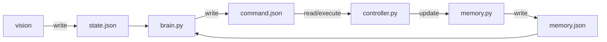
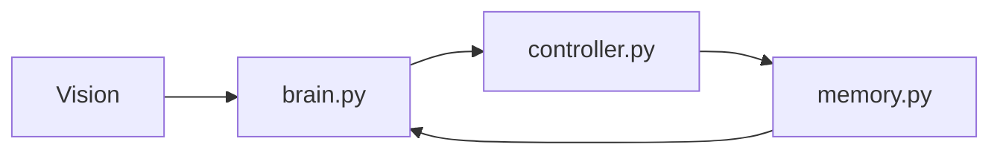
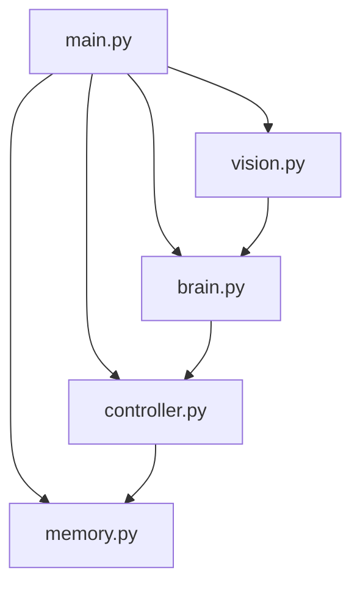

# robot_prome_v1

| | |
|---|---|
| **Автор** | Vlad Orlinskas |
| **Сайт** | [prometeriy.com](https://prometeriy.com) |
| **Цель** | Эксперимент: автономный робот на LLM (vision + brain) |
| **Лицензия** | Свободное использование |

Легкая модульная архитектура управления роботом через JSON-файлы.

## Схема взаимодействия



## Упрощенная блок схема 





## Что делает каждый модуль


- `main.py` — поднимает все потоки и корректно завершает систему
- `settings.py` — (shared module) настройки, константы, промпты, модели, стейты и безопасный JSON I/O
- `vision.py` — захватывает кадр камеры (OpenCV) и пишет `state.json`
- `brain.py` — читает `state.json` и `memory.json`, принимает решение через LLM (via Ollama), пишет `command.json`
- `controller.py` — исполняет команду из `command.json` на моторах
- `memory.py` — хранит последние n-команд для принятия решений в `brain.py`

## Видеопоток камеры

При запуске с камерой (OpenCV) автоматически поднимается MJPEG-сервер. Откройте в браузере URL, который выводится при старте:

```
  ========================================================
  ВИДЕО ПОТОК КАМЕРЫ — откройте в браузере:
  http://192.168.x.x:8765
  (локально: http://127.0.0.1:8765)
  ========================================================
```

- Порт по умолчанию: `8765`. Можно изменить: `python3 main.py --stream-port 9000`
- Отключить поток: `python3 main.py --no-stream`
- Поток использует кадры из основного vision-цикла и не влияет на работу робота

## Быстрый старт

```bash
cd robot_prome_v1
python3 main.py
```