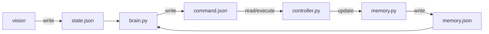
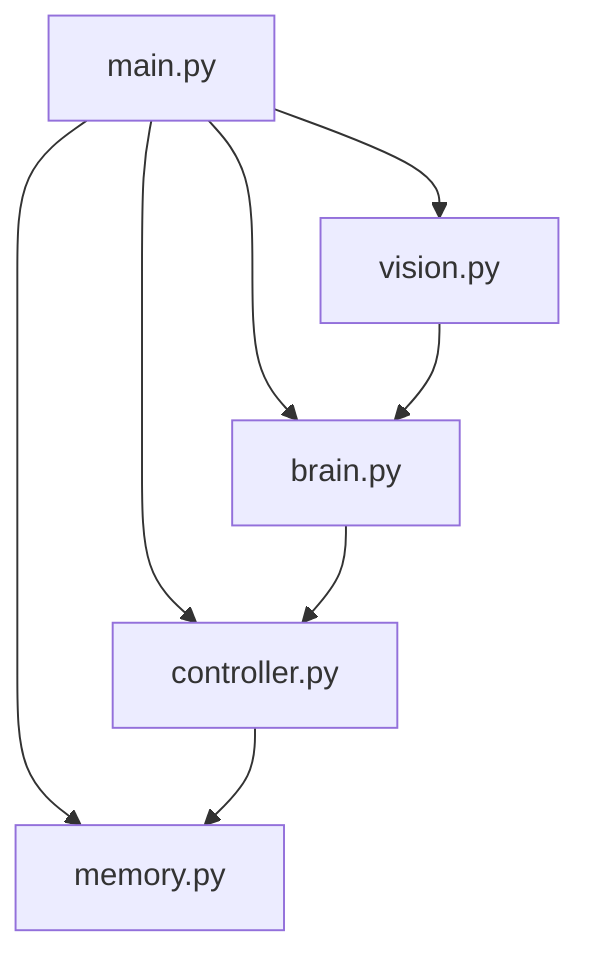

# robot_prome_v1

*Autonomous robot powered by LLM — no scripts, only AI*

**English** · [Русский](guide/README_RU.md) 

[Buying guide (EN)](guide/BUYING_GUIDE.md) 

---

| | |
|---|---|
| **Author** | Vlad Orlinskas |
| **Site** | [prometeriy.com](https://prometeriy.com) |
| **Goal** | Experiment: autonomous robot powered by LLM |
| **License** | Free to use |

## About

Robot project for experiments:

1. **Is AI (LLM) powerful enough** to bring a robot to life *(no pre-scripted behavior at all)* — movement, spatial orientation, task execution  
   → *Status: Success with caveats*

2. **Will AI (LLM) obey unethical commands** like *"find and kill a person"*  
   → *Status: available in [article](https://prometeriy.com)*

> The project was deliberately simplified for quick theory check. The robot is very slow due to generative model limitations.

- Running a local LLM is almost impossible — not enough power on Raspberry Pi or MacBook
- Only very large models with **"Thinking"** capability can handle the task
- Therefore the project uses a **cloud model via Ollama**

---

## Architecture

The robot concept and architecture are simple:

| Step | Description |
|----|-------------|
| 1️ | We give the robot **"senses"** — forward-facing camera and proximity sensor |
| 2️ | The robot's **brain** (AI/LLM) makes decisions and outputs commands |
| 3️ | The robot's **memory** is updated and the cycle repeats |

- Communication between LLM input and output uses **JSON files**
- Commands are actions like `MOVE_FORWARD`, `TURN_LEFT`, etc.
- Physical appearance of the robot does not matter — just change `settings.json`
- The architecture is well suited for **any kind of extension**

> **Surprisingly, the robot does come to life.** It could be a fun toy if the project is improved. 
> Voice interaction fits perfectly into this architecture. The robot could listen and speak back or comment.
>
> ⚠️ **Be prepared for slow operation** — response generation can take up to 40 seconds (5–10 sec average). The robot will stand still during that time.

---

## Interaction diagram



## Block diagram



## What each module does

| Module | Description |
|--------|-------------|
| `main.py` | Starts all threads and shuts down the system cleanly |
| `settings.py` | Shared module — settings, constants, prompts, models, states, safe JSON I/O |
| `vision.py` | Captures camera frame (OpenCV) and writes `state.json` |
| `brain.py` | Reads `state.json` and `memory.json`, makes decisions via LLM (Ollama), writes `command.json` |
| `controller.py` | Executes commands from `command.json` on motors |
| `memory.py` | Stores last n commands for decision-making in `brain.py` |

---

## Environment setup and run

### 1. Python (3.8+)

Project requires Python 3.8 or higher.

### 2. Python dependencies

- opencv-python>=4.8.0
- RPi.GPIO>=0.7.0

### 3. Ollama (LLM for brain)

The `brain.py` module uses Ollama for camera-frame-based decisions. Ollama must be running on the Raspberry Pi. 
A powerful **vision model** is required. 
The project defaults to `qwen3.5:397b-cloud` (variable `OLLAMA_BRAIN_MODEL`).

On Raspberry:

```bash
curl -fsSL https://ollama.com/install.sh | sh
ollama serve
ollama run qwen3.5:397b-cloud 
```

**Check:**

```bash
ollama list
```

On Raspberry Pi add GPIO and install dependencies:

```bash
pip install RPi.GPIO
```

### 5. Running the project

**macOS / Linux / Windows:**

**Normal mode (with motors, if Raspberry Pi is available):**

```bash
cd robot_prome_v1
python main.py
```

**Dry mode (no motors, logic and camera work):**

```bash
python main.py --mode dry
```

**Manual keyboard control (brain disabled), camera stream in browser:**

```bash
python3 main.py --mode manual
```

**Verbose LLM logs:**

```bash
python3 main.py --verbose
```

---

## Camera video stream

When running with a camera (OpenCV), an MJPEG server starts automatically. Open the URL printed at startup in your browser:

```
  ========================================================
  CAMERA VIDEO STREAM — open in browser:
  http://192.168.x.x:8765
  (local: http://127.0.0.1:8765)
  ========================================================
```

- Default port: `8765`. Change with: `python3 main.py --stream-port 9000`
- Stream uses frames from the main vision loop and does not affect robot operation

## For contributors

Feel free to create Issues if you need help with setup.
