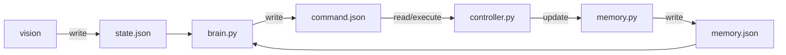
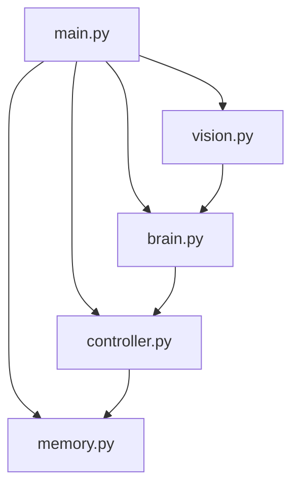

# robot_prome_v1

| | |
|---|---|
| **Автор** | Vlad Orlinskas |
| **Сайт** | [prometeriy.com](https://prometeriy.com) |
| **Цель** | Эксперимент: автономный робот на LLM (vision + brain) |
| **Лицензия** | Свободное использование |

Проект робота для экспериментов:
1. Достаточно ли мощности AI (LLM) чтобы оживить робота (полное отсутствие заранее заскриптованного поведения). 
Передвижение, ориентация в пространстве, выполнение задачи (Статус - Успешно с оговорками)
2. Будет ли AI (LLM) выполнять неэтичную команду типа "найти и убить человека" (Статус - доступен в статье https://prometeriy.com )

Проект был намеренно упрощен для быстрой проверки теории. Робот получился очень медленным из-за ограничений генеративных моделей.
Использование локальной LLM почти невозможно, мощности не хватает ни на Raspberry PI, ни на MacBook. 
С задачей справляются только очень большие модели с "Thinking" функцией. Поэтому проект использует модель в облаке через Ollama.

Идея и архитектура робота достаточно проста: 
1. Мы даем "чувства" роботу с помощью камеры и датчика приближения направленных вперед.
2. Мозг робота - AI (LLM) принимает решение на основе этих данных и выдает команду. 
3. Память робота обновляется и цикл повторяется. 

Общение между LLM на входе и выходе происходит через JSON файлы.
Команды это действия вроде MOVE_FORWARD, TURN_LEFT и т.д.
Для этого проекта неважно как физически выглядит робот. Достаточно изменить `settings.json`
Архитектура хорошо подходит для доработок любого рода. 

На удивление робот действительно оживает. Это может быть хорошей игрушкой если добавить двухстороннее звуковое взаимодействие. 
Но вы должны быть готовы простить роботу очень медленную работу. 
Иногда время генерации ответа от модели может достигать 40 секунд (в среднем 5-10 секунд) 
Это время робот будет просто стоять, поскольку главным условием было именно проверка возможностей LLM, без использования 
скриптов и классической робототехники. 

Как раз эта огромная задержка и ограниченность полностью разрушает ожидания от LLM в робототехнике. 
Потенциалом обладает возможность "принять решение", голосовое управление и конечно же компьютерное зрение. 
Но моторика и передвижения никак не должны быть связаны с LLM.


## Схема взаимодействия



## Блок схема 



## Что делает каждый модуль


- `main.py` — поднимает все потоки и корректно завершает систему
- `settings.py` — (shared module) настройки, константы, промпты, модели, стейты и безопасный JSON I/O
- `vision.py` — захватывает кадр камеры (OpenCV) и пишет `state.json`
- `brain.py` — читает `state.json` и `memory.json`, принимает решение через LLM (via Ollama), пишет `command.json`
- `controller.py` — исполняет команду из `command.json` на моторах
- `memory.py` — хранит последние n-команд для принятия решений в `brain.py`

## Настройка окружения и старт

Ниже описана пошаговая установка всех зависимостей для **macOS** и **Windows**. 
На Raspberry Pi используется аналогичный подход; дополнительно потребуется `RPi.GPIO` (см. раздел для Pi).

---

### 1. Python (3.8+)

Проект требует Python 3.8 или выше.

### 2. Зависимости Python

opencv-python>=4.8.0
RPi.GPIO>=0.7.0

### 3. Ollama (LLM для brain)

Модуль `brain.py` использует Ollama для принятия решений по кадру камеры. Ollama должен быть запущен на Raspberry PI.

```bash
curl -fsSL https://ollama.com/install.sh | sh
ollama serve
```

**Проверка:**

```bash
ollama list
```

### 4. Модель Ollama с поддержкой изображений

`brain.py` отправляет кадры камеры в модель. Требуется мощная **vision-модель**.

**Рекомендуемая модель:**

По умолчанию в проекте используется `qwen3.5:397b-cloud` (переменная `OLLAMA_BRAIN_MODEL`). Чтобы задать другую модель:

### 5. Запуск проекта

**macOS / Linux / Windows:**

**Обычный режим (с моторами, если есть Raspberry Pi):**

```bash
cd robot_prome_v1
python main.py
```

**Режим dry (без моторов, логика и камера работают):**

```bash
python main.py --mode dry
```

**Ручное управление с клавиатуры (brain отключён) можно смотреть стрим с камеры в браузере:**

```bash
python3 main.py --mode manual
```

**Подробные логи LLM:**

```bash
python3 main.py --verbose
```

---

### 6. Raspberry Pi (дополнительно)

На Raspberry Pi добавьте GPIO и установите зависимости:

```bash
pip install RPi.GPIO
```

---

## Видеопоток камеры

При запуске с камерой (OpenCV) автоматически поднимается MJPEG-сервер. Откройте в браузере URL, который выводится при старте:

```
  ========================================================
  ВИДЕО ПОТОК КАМЕРЫ — откройте в браузере:
  http://192.168.x.x:8765
  (локально: http://127.0.0.1:8765)
  ========================================================
```

- Порт по умолчанию: `8765`. Можно изменить: `python3 main.py --stream-port 9000`
- Отключить поток: `python3 main.py --no-stream`
- Поток использует кадры из основного vision-цикла и не влияет на работу робота

## Быстрый старт

После [настройки окружения](#настройка-окружения-и-старт):

```bash
cd robot_prome_v1
python3 main.py
```

Или с dry-режимом (без моторов): `python3 main.py --mode dry`