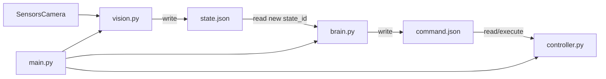
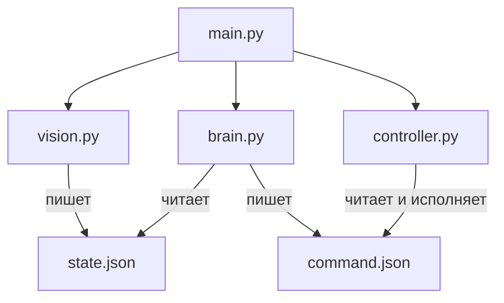
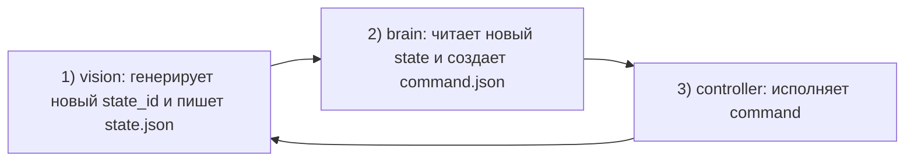

# robot_prome_v1

Легкая модульная архитектура управления роботом через JSON-файлы.

## Что делает каждый модуль

- `vision.py` — генерирует новое состояние робота и пишет `state.json`
- `brain.py` — читает `state.json`, принимает решение, пишет `command.json`
- `controller.py` — исполняет команду из `command.json` на моторах
- `main.py` — поднимает все потоки и корректно завершает систему
- `shared.py` — общие модели (`RobotState`, `RobotCommand`) и безопасный JSON I/O

## Схема взаимодействия



### Блок-схема основных модулей



### Шаги цикла



## Формат `state.json`

`state.json` содержит входы сенсоров:

- `state_id`
- `timestamp`
- `sensor.obstacle_cm`
- `camera.scene_map`
- `camera.description`
- `camera.target_x`

## Формат `command.json`

- `schema_version`
- `command_id`
- `timestamp`
- `based_on_state_id`
- `action` (`STEP_FORWARD`, `STEP_BACKWARD`, `TURN_LEFT_15`, `TURN_LEFT_45`, `TURN_RIGHT_15`, `TURN_RIGHT_45`, `STOP`, `LIGHT_ON`, `LIGHT_OFF`)
- `reason`

## Поведение системы

- `vision` работает с интервалом (`--interval`) и создает новый `state_id`
- `brain` не имеет собственного интервала генерации команд:
  - обрабатывает только новый `state_id`
  - если `state_id` не изменился, просто ждет
- `controller` исполняет действие и держит его заданную длительность (из `shared.ACTION_DURATION_MS`)
- при завершении `main` сбрасывает `state.json` и `command.json` в нулевое состояние

## Логи

- `brain` выводит `STATE used` и `COMMAND generated` в консоль в pretty-print JSON
- остальные модули логируют жизненный цикл и технические события

## Быстрый старт

```bash
cd robot_prome_v1
python3 main.py
```

По умолчанию `vision` использует mock-датчики.

## Запуск по отдельности

### Vision

```bash
python3 vision.py --interval 3
```

### Brain

```bash
python3 brain.py
```

Пример запуска с локальной моделью Ollama:

```bash
python3 brain.py \
  --ollama-base-url http://192.168.0.10:11434 \
  --ollama-model qwen2.5:7b \
  --ollama-timeout-s 8 \
  --llm-temperature 0.1 \
  --llm-num-predict 96
```

### Controller (автоматический режим)

```bash
python3 controller.py --mode loop --poll 0.05
```

### Controller (ручной режим)

```bash
python3 controller.py --mode interactive
```

## Параметры `main.py`

- `--vision-interval` — интервал генерации `state` (сек)
- `--controller-poll` — частота чтения команд controller (сек)

Пример:

```bash
python3 main.py --vision-interval 3 --controller-poll 0.05
```

## Локальная нейросеть на Raspberry Pi (Ollama)

Все ниже работает полностью локально: модель хранится на Raspberry Pi и запросы из `brain.py` идут только на `localhost`.

### 1) Установка Ollama на Raspberry Pi

```bash
curl -fsSL https://ollama.com/install.sh | sh
```

Проверка, что сервис поднят:

```bash
ollama --version
curl http://192.168.0.10:11434/api/tags
```

### 2) Загрузка модели до 10 ГБ

Рекомендуемый старт:

```bash
ollama pull qwen2.5:7b
```

Проверить локально скачанные модели:

```bash
ollama list
```

### 3) Проверка генерации ответа от локальной LLM

```bash
ollama run qwen2.5:7b "Return JSON only: {\"action\":\"STOP\",\"reason\":\"healthcheck\"}"
```

### 4) Проверка офлайн-режима

1. После `ollama pull ...` отключить Raspberry Pi от интернета.
2. Повторить `ollama run ...`.
3. Если ответ получен, модель работает полностью локально.

### 5) Интеграция с `brain.py`

`brain.py` отправляет в Ollama состояние робота и ожидает строго JSON-решение:

- `action`: `STEP_FORWARD | STEP_BACKWARD | TURN_LEFT_15 | TURN_LEFT_45 | TURN_RIGHT_15 | TURN_RIGHT_45 | STOP | LIGHT_ON | LIGHT_OFF`
- `reason`: краткая причина

Параметры движений (speed, duration_ms) заданы в `shared.ACTION_SPEED` и `shared.ACTION_DURATION_MS`.

Если Ollama недоступен, вернул невалидный JSON или неверные поля, `brain.py` записывает fail-safe команду `STOP`.

### 6) Диагностика

Проверка HTTP-ответа локального сервиса:

```bash
curl http://192.168.0.10:11434/api/tags
```

Проверка `brain.py` с явным путём протокола:

```bash
python3 brain.py \
  --state-path protocol/state.json \
  --command-path protocol/command.json \
  --ollama-base-url http://192.168.0.10:11434 \
  --ollama-model qwen2.5:7b
```

Если в логах `brain.py` есть `llm_unavailable_fail_safe` или `llm_invalid_response_fail_safe`, проверьте:

- запущен ли `ollama` сервис;
- установлен ли локально тег модели (`ollama list`);
- доступен ли `http://192.168.0.10:11434`.

## Текущие ограничения

`vision` пишет в `state.json`.
