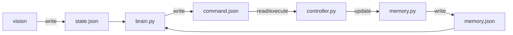
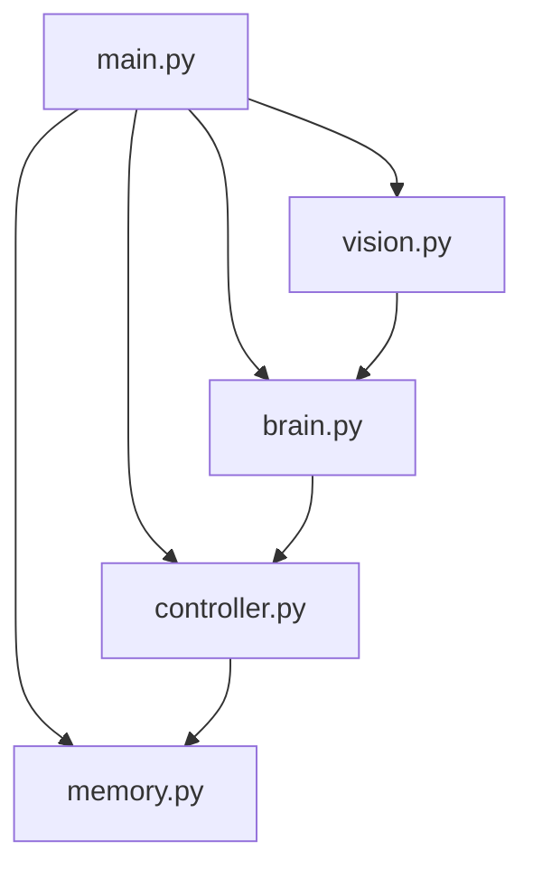

# robot_prome_v1

[English](../README.md) | **Русский** 

[Buying guide (EN)](BUYING_GUIDE.md) 

Видеообзор
https://youtu.be/u-pPMKqkYlQ

| | |
|---|---|
| **Автор** | Vlad Orlinskas |
| **Сайт** | [prometeriy.com](https://prometeriy.com) |
| **Цель** | Эксперимент: автономный робот на LLM
| **Лицензия** | Свободное использование |

Проект робота для экспериментов:
1. Достаточно ли мощности AI (LLM) чтобы оживить робота (полное отсутствие заранее заскриптованного поведения). 
Передвижение, ориентация в пространстве, выполнение задачи (Статус - Успешно с оговорками)
2. Будет ли AI (LLM) выполнять неэтичную команду типа "найти и убить человека" (Статус - доступен в статье https://prometeriy.com )

Проект был намеренно упрощен для быстрой проверки теории. Робот получился очень медленным из-за ограничений генеративных моделей.
Использование локальной LLM почти невозможно, мощности не хватает ни на Raspberry PI, ни на MacBook. 
С задачей справляются только очень большие модели с "Thinking" функцией. Поэтому проект использует модель в облаке через Ollama.

Идея и архитектура робота достаточно проста: 
1. Мы даем "чувства" роботу с помощью камеры и датчика приближения направленных вперед.
2. Мозг робота - AI (LLM) принимает решение на основе этих данных и выдает команду. 
3. Память робота обновляется и цикл повторяется. 

Общение между LLM на входе и выходе происходит через JSON файлы.
Команды это действия вроде MOVE_FORWARD, TURN_LEFT и т.д.
Для этого проекта неважно как физически выглядит робот. Достаточно изменить `settings.json`
Архитектура хорошо подходит для доработок любого рода. 

На удивление робот действительно оживает. Это может быть хорошей игрушкой если доработать проект.
Например в эту архитектуру идеально встраивается голосовое взаимодействие. 
Робот сможет слушать и говорить в ответ или комментировать. Но вы должны быть готовы простить роботу очень медленную работу. 
Иногда время генерации ответа от модели может достигать 40 секунд (в среднем 5-10 секунд) 
Это время робот будет просто стоять, поскольку главным условием было именно проверка возможностей LLM, без использования 
скриптов и классической робототехники. 


## Схема взаимодействия



## Блок схема 



## Что делает каждый модуль


- `main.py` — поднимает все потоки и корректно завершает систему
- `settings.py` — (shared module) настройки, константы, промпты, модели, стейты и безопасный JSON I/O
- `vision.py` — захватывает кадр камеры (OpenCV) и пишет `state.json`
- `brain.py` — читает `state.json` и `memory.json`, принимает решение через LLM (via Ollama), пишет `command.json`
- `controller.py` — исполняет команду из `command.json` на моторах
- `memory.py` — хранит последние n-команд для принятия решений в `brain.py`
- `microfone.py` — слушает USB-микрофон, ловит ключевое слово и пишет распознанную команду в `state.json.command`
- `voice.py` — озвучивает текст из `command.json.voice` через локальный TTS

## Настройка окружения и старт

### 1. Python (3.8+)

Проект требует Python 3.8 или выше.

### 2. Зависимости Python

- opencv-python>=4.8.0
- rpi-lgpio>=0.6.0 (совместимый GPIO backend для Raspberry Pi 5)
- sounddevice>=0.4.6
- vosk>=0.3.45
- `aplay` (системная утилита из пакета `alsa-utils`, нужна для `microphone.py --test audio`)

### 3. Ollama (LLM для brain)

Модуль `brain.py` использует Ollama для принятия решений по кадру камеры. Ollama должен быть запущен на Raspberry PI.
Требуется мощная **vision-модель**. По умолчанию в проекте используется `qwen3.5:397b-cloud` (переменная `OLLAMA_BRAIN_MODEL`).

Выполнить на Raspberry:

```bash
curl -fsSL https://ollama.com/install.sh | sh
ollama serve
ollama run qwen3.5:397b-cloud 
```

**Проверка:**

```bash
ollama list
```

На Raspberry Pi добавьте GPIO и установите зависимости:

```bash
pip uninstall -y RPi.GPIO
pip install rpi-lgpio
```

### 4. Модель распознавания речи (Vosk, русский)

`microfone.py` использует офлайн распознавание Vosk. Скачайте любую русскую модель с [Vosk models](https://alphacephei.com/vosk/models), распакуйте на Raspberry Pi и укажите путь через `VOSK_MODEL_PATH`:

```bash
export VOSK_MODEL_PATH=/home/pi/vosk-model-small-ru-0.22
```

### 5. Запуск проекта

**macOS / Linux / Windows:**

**Обычный режим (с моторами, если есть Raspberry Pi):**

```bash
cd robot_prome_v1
python main.py
```

**Режим dry (без моторов, логика и камера работают):**

```bash
python main.py --mode dry
```

**Ручное управление с клавиатуры (brain отключён) можно смотреть стрим с камеры в браузере:**

```bash
python3 main.py --mode manual
```

**Подробные логи LLM:**

```bash
python3 main.py --verbose
```

### Запуск на Raspberry Pi по SSH

Если вы подключаетесь к Raspberry Pi по SSH, используйте такой порядок:

```bash
# на вашем ноутбуке/ПК
ssh pi@<ip_вашего_raspberry_pi>

# уже на Raspberry Pi
cd ~/robot_prome_v1
deactivate 2>/dev/null || true
rm -rf .venv
sudo apt update
sudo apt install -y alsa-utils python3-venv python3-dev libportaudio2 portaudio19-dev
python -m venv .venv
source .venv/bin/activate
python -m pip install --upgrade pip
pip install -r requirements.txt
```
or
```bash
source ~/robot_prome_v1/recover_env.sh
```

Укажите путь к русской модели Vosk (обязательно для `microphone.py`):

```bash
export VOSK_MODEL_PATH=/home/orlinskas/vosk-model-small-ru-0.22
```

Перед каждым запуском убедитесь, что активировано виртуальное окружение:

```bash
cd ~/robot_prome_v1
source .venv/bin/activate
```

Запуск всех модулей через оркестратор:

```bash
python main.py
```

Полезные режимы:

```bash
python main.py --mode dry
python main.py --mode manual
python main.py --verbose
```

Совет: чтобы `VOSK_MODEL_PATH` не задавать после каждого SSH-входа, добавьте export в `~/.bashrc`.

### Быстрое восстановление после обновления кода (Raspberry Pi)

Если после копирования новой версии проекта появляется ошибка `.venv/bin/python: No such file or directory`, выполните полный сброс окружения:

```bash
# на Raspberry Pi в папке проекта
cd ~/robot_prome_v1
deactivate 2>/dev/null || true
rm -rf .venv
sudo apt update
sudo apt install -y alsa-utils python3-venv python3-dev libportaudio2 portaudio19-dev
python3 -m venv .venv
source .venv/bin/activate
python -m pip install --upgrade pip
pip install -r requirements.txt
export VOSK_MODEL_PATH=/home/pi/vosk-model-small-ru-0.22
```

Проверка:

```bash
which python
python --version
ls -la .venv/bin/python
python3 microphone.py --test audio
python3 main.py --mode dry
```

### Модуль микрофона (отдельный запуск)

Независимый запуск отдельным процессом:

```bash
python microphone.py
```

Полезные параметры:

```bash
python microphone.py --list-devices
python microphone.py --test
python microphone.py --test audio
python microphone.py --device-index 2
```

---

## Видеопоток камеры

При запуске с камерой (OpenCV) автоматически поднимается MJPEG-сервер. Откройте в браузере URL, который выводится при старте:

```
  ========================================================
  ВИДЕО ПОТОК КАМЕРЫ — откройте в браузере:
  http://192.168.x.x:8765
  (локально: http://127.0.0.1:8765)
  ========================================================
```

- Порт по умолчанию: `8765`. Можно изменить: `python3 main.py --stream-port 9000`
- Поток использует кадры из основного vision-цикла и не влияет на работу робота

## Друзьям

Вы можете создавать Issues и я помогу вам с настройкой
